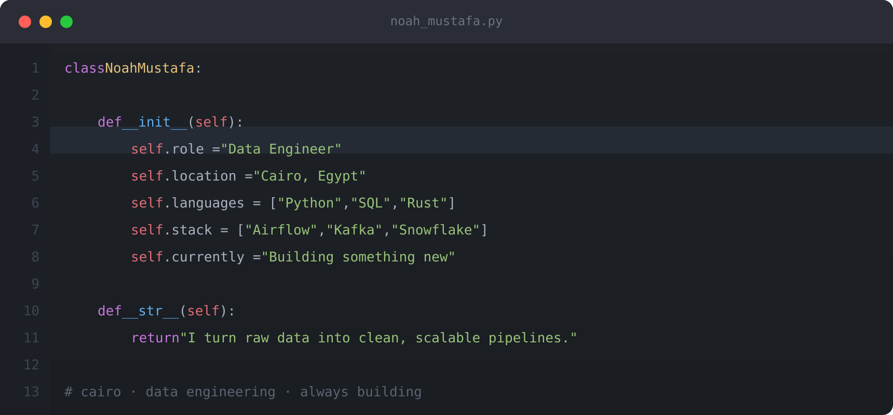

 

---

## About Me

  

---

## Tech Stack

**Languages & Scripting**

**Data Engineering & Orchestration**

**Databases**

**Data Science & Analytics**

**Tools & Environment**

---

## Featured Projects

| Project | Description | Stack |
|---------|-------------|-------|
| [Aither Download Manager](https://github.com/NoahMustafa/Aither-Download-Manager) | Next-generation cross-platform download manager, built for speed and modern UX | `Tauri` `Rust` `React` |
| [Weather Pipeline](https://github.com/NoahMustafa/Weather_Pipeline) | Automated ETL collecting real-time weather data from 3,500+ cities worldwide | `Airflow` `AsyncIO` `PostgreSQL` |
| [Crypto Data Pipeline](https://github.com/NoahMustafa/Data_pipeline_CryptoCurrencies) | End-to-end real-time crypto pipeline — scrapes, processes, and loads every 15 minutes | `Python` `PostgreSQL` |
| [Product Sales Analytics](https://github.com/NoahMustafa/ProductSalesProject) | End-to-end analytics project with an interactive Power BI dashboard | `Power BI` `Python` |
| [Data Cleaning V1](https://github.com/NoahMustafa/Data-Cleaning-Using-Python-V1) | Retail transaction dataset cleaning — invalid entries, format standardization | `Python` `Pandas` |
| [Data Cleaning V2](https://github.com/NoahMustafa/Data-Cleaning-Using-Python-V2) | DS job postings dataset cleaning, prepared for analysis and ML tasks | `Python` `Jupyter` |

---

## GitHub Stats

 

  

---

## Trophies

---

## Dev Quote

---

## Support

If something I built saved you time or sparked an idea, consider supporting the work.

---

